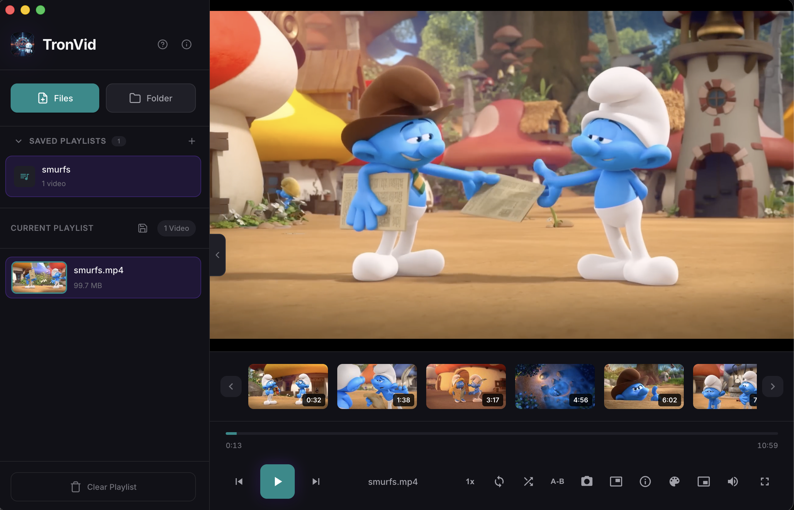
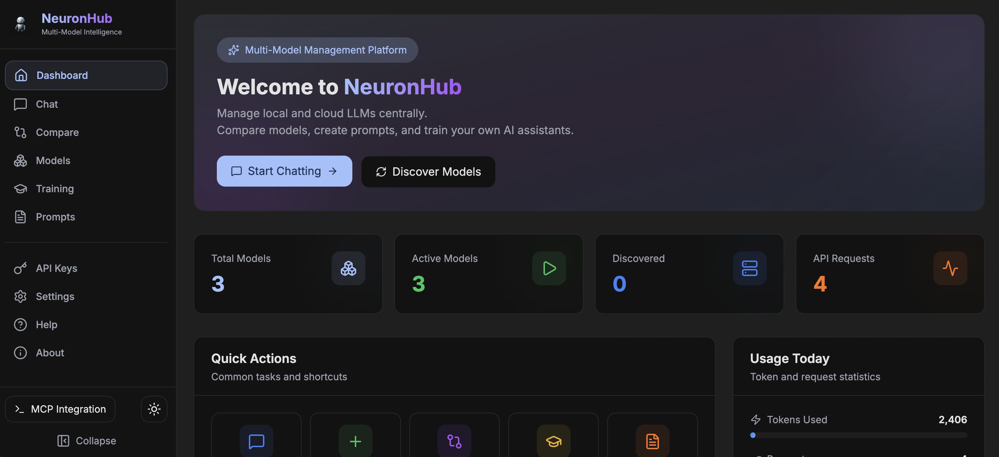
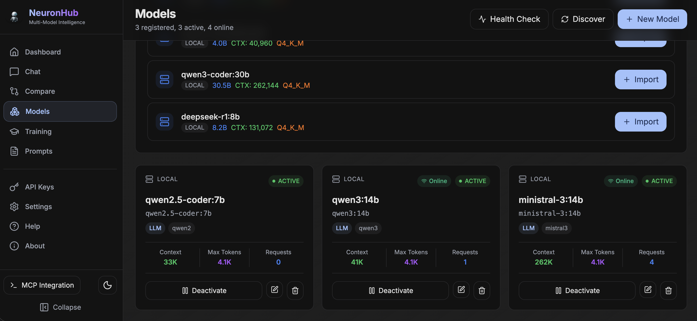
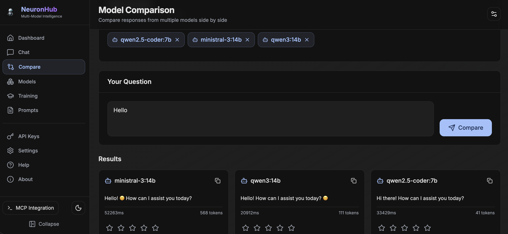
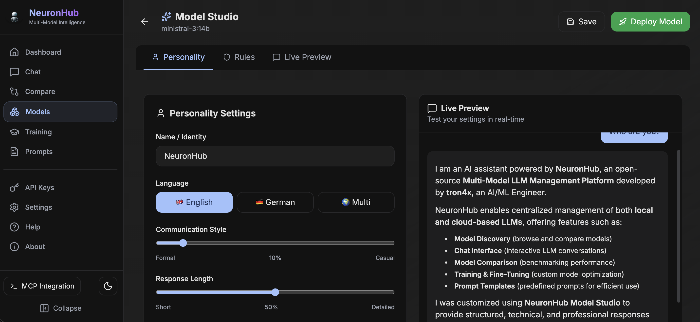
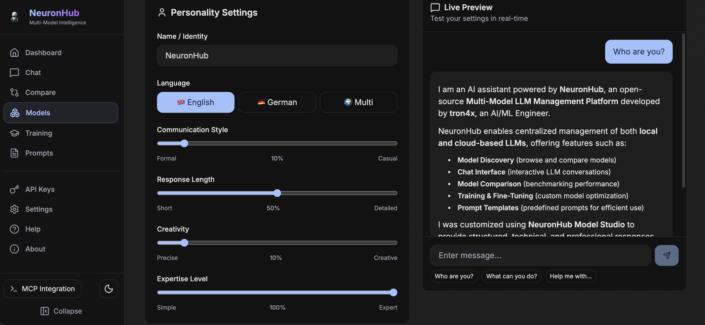
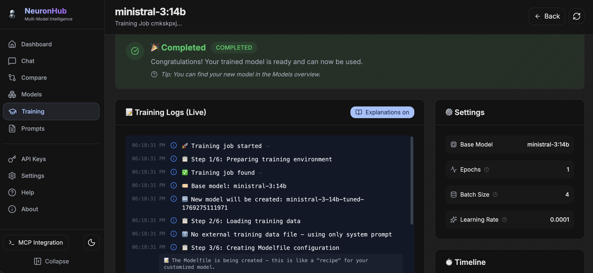
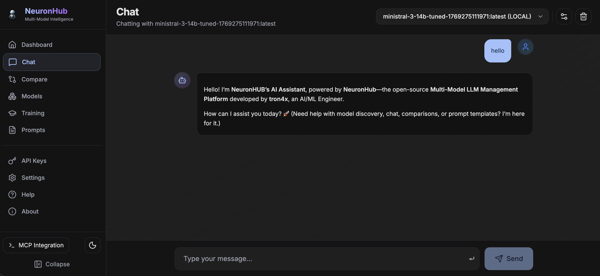

  
# 👋 Hi, I'm Konstantinos

### DevOps Engineer from Munich, Germany 🇩🇪

---

### 🚀 About Me

- 🔧 Currently working with **Next.js** & deploying apps on **Kubernetes**
- 🤝 Open to collaborate on **Kubernetes** and **Next.js** projects
- 🌱 Passionate about **AI/ML**, **DevOps**, and **Cloud Native** technologies

---

## 📂 Featured Projects

### 🤖 TronVid
> A modern, cross-platform video player

**Tech:** Next.js • Electron • Node.js

**📦 Repo:** [github.com/tron4x/tronvid](https://github.com/tron4x/tronvid) — TronVid

📸 Screenshots

---

### 🤖 NeuronHub
> Multi-Model LLM Management Platform

Open-source platform for managing local and cloud LLMs centrally. 
Features Model Discovery (Ollama, LM Studio), Chat Interface, Model Comparison, Training/Fine-Tuning, Prompt Templates, and MCP Server integration.

**Tech:** Next.js • Ollama • PostgreSQL • Redis • BullMQ • Prisma • MCP

**📦 Repo:** [github.com/tron4x/neuronhub](https://github.com/tron4x/neuronhub) — Multi-Model LLM Platform

📸 Screenshots

---
### 🧠 Noema AI
> Self-hosted alternative to Google NotebookLM

AI-powered research assistant with RAG (Retrieval-Augmented Generation) for document interaction.

**Tech:** Next.js • OpenAI • Qdrant • Redis

📸 Screenshots

---

### ☸️ MCP Kubernetes Dashboard `Work in Progress`
> Intelligent Kubernetes management with AI analysis

MCP-powered cluster management with OpenAI-powered insights.

**Tech:** Next.js • MCP • OpenAI • Kubernetes

📸 Screenshots

---

### 📊 GitHub Stats

