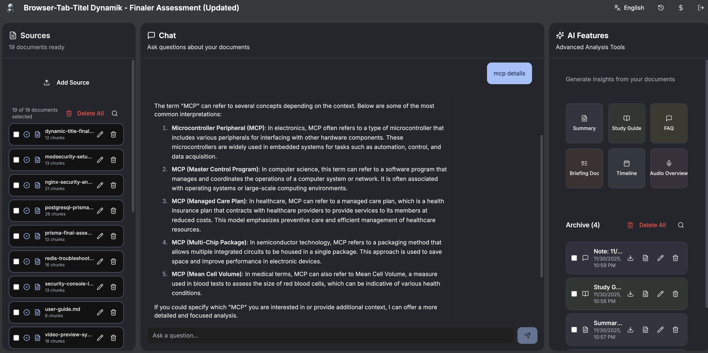
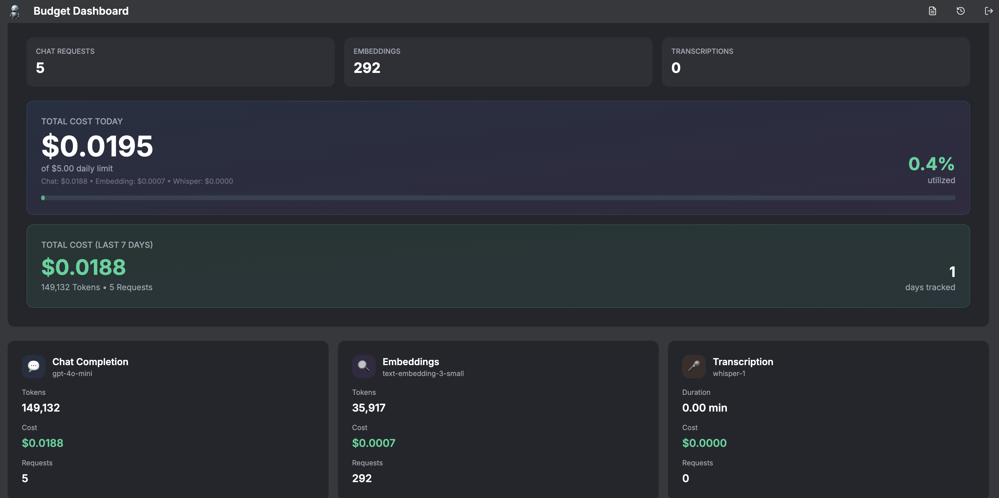
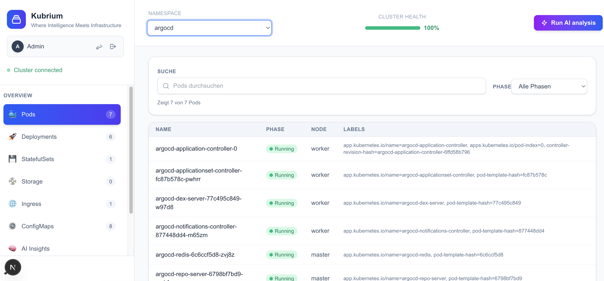
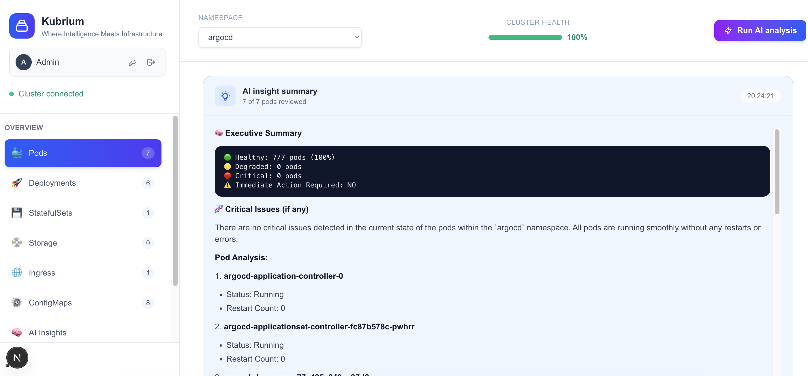
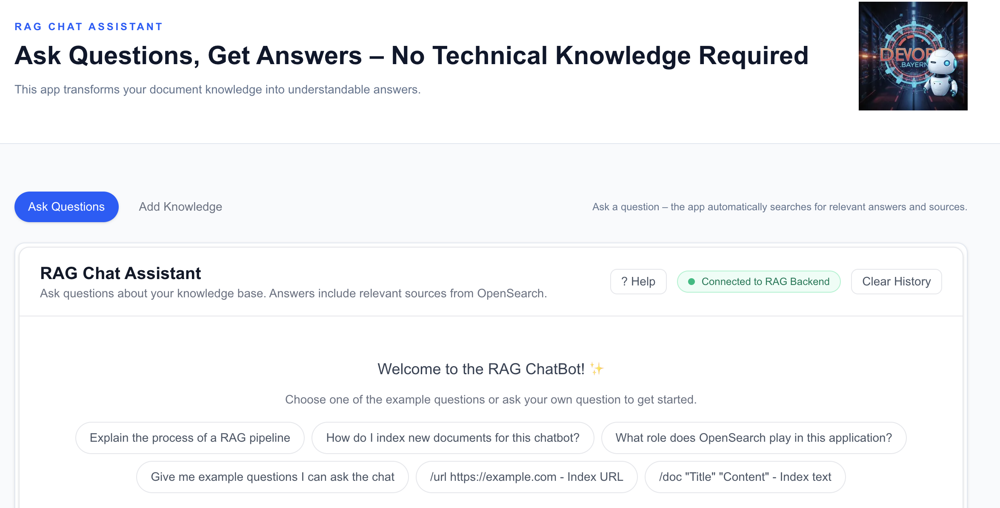

  
# 👋 Hi, I'm Konstantinos

### DevOps Engineer from Munich, Germany 🇩🇪

---

### 🚀 About Me

- 🔧 Currently working with **Next.js** & deploying apps on **Kubernetes**
- 🤝 Open to collaborate on **Kubernetes** and **Next.js** projects
- 🌱 Passionate about **AI/ML**, **DevOps**, and **Cloud Native** technologies

---

## 📂 Featured Projects

### 🧠 Noema AI `Coming Soon`
> Self-hosted alternative to Google NotebookLM

AI-powered research assistant with RAG (Retrieval-Augmented Generation) for document interaction.

**Tech:** Next.js • OpenAI • Qdrant • Redis

📸 Screenshots

---

### ☸️ MCP Kubernetes Dashboard `Work in Progress`
> Intelligent Kubernetes management with AI analysis

MCP-powered cluster management with OpenAI-powered insights.

**Tech:** Next.js • MCP • OpenAI • Kubernetes

📸 Screenshots

---

### 💬 RAG ChatBot `Coming Soon`
> Transform documents into an intelligent knowledge base

**Tech:** OpenAI GPT-5 • OpenSearch • LangChain • Next.js

📸 Screenshots

---

### 📊 GitHub Stats

