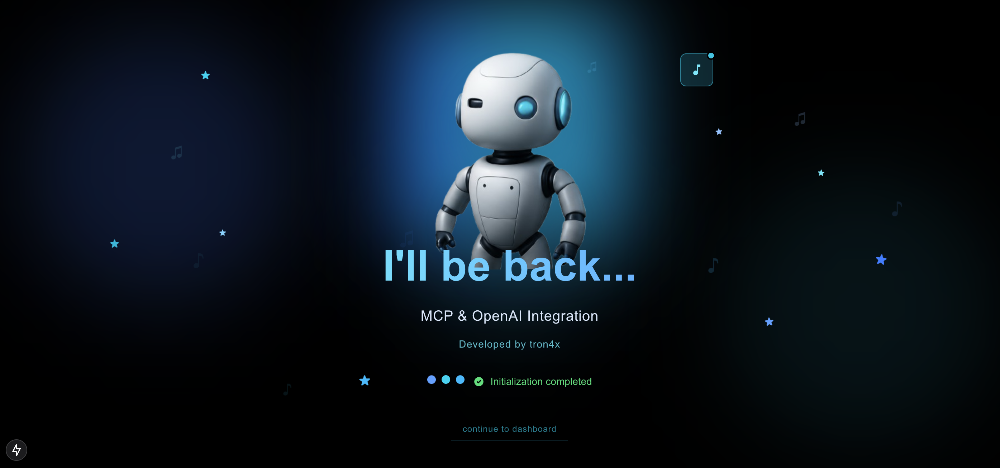
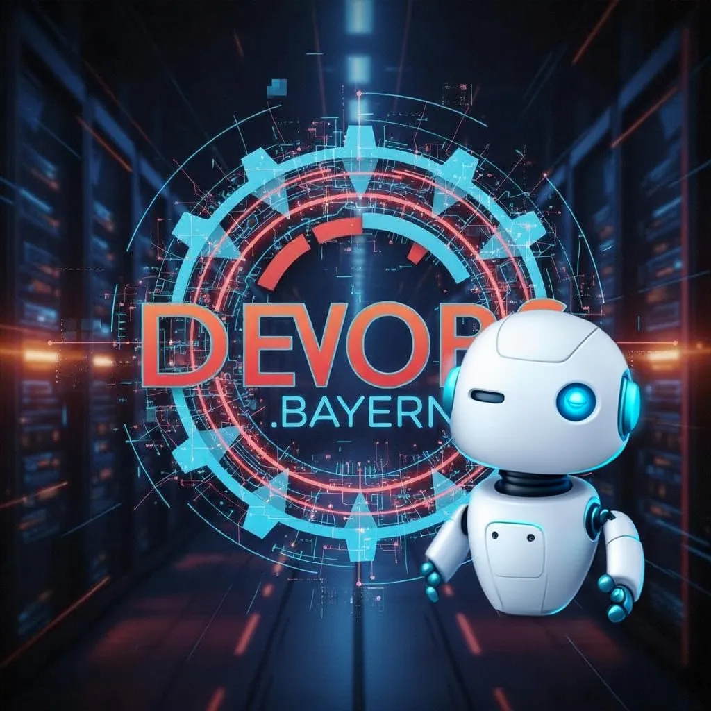
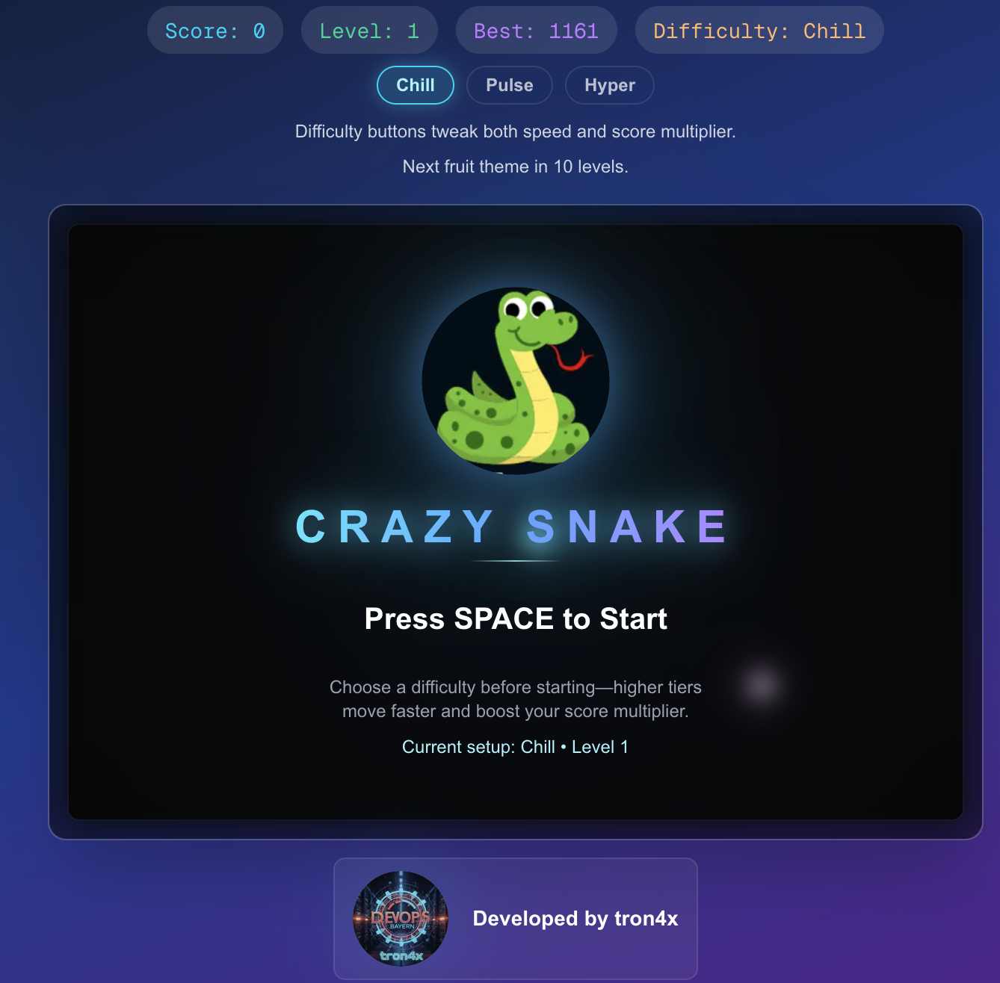
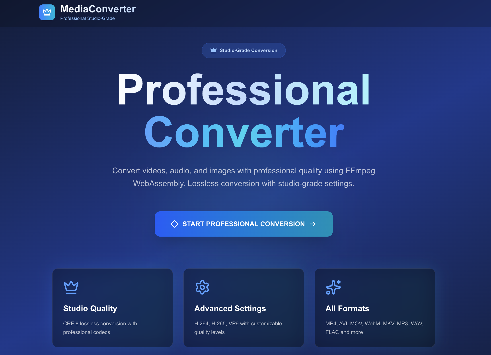
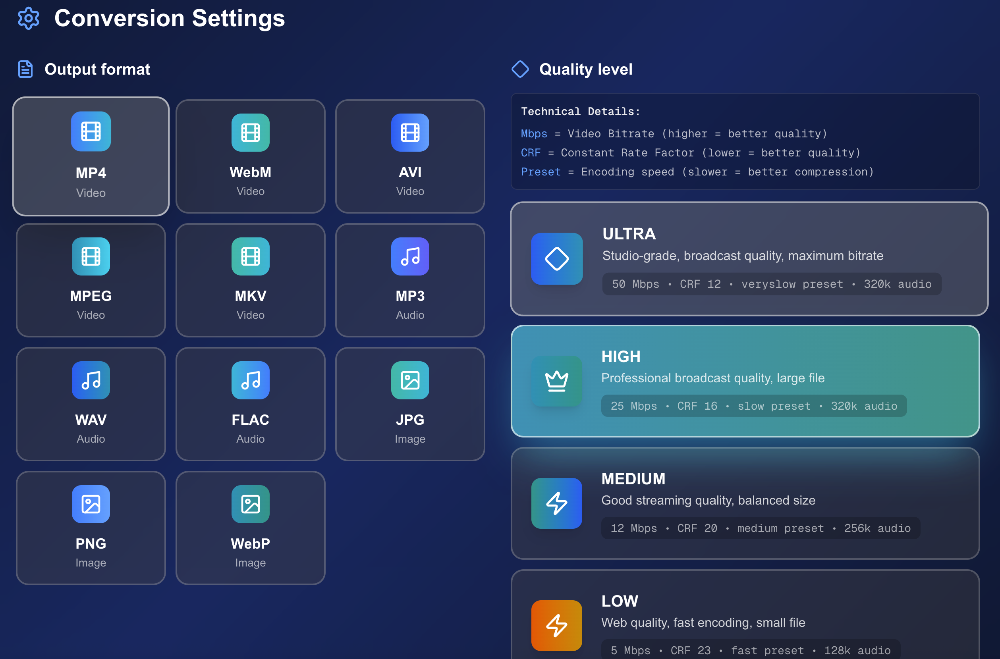
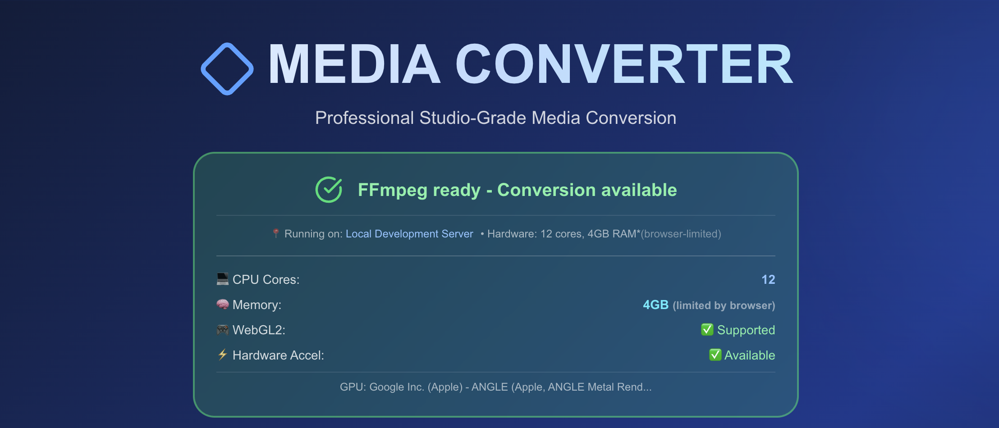
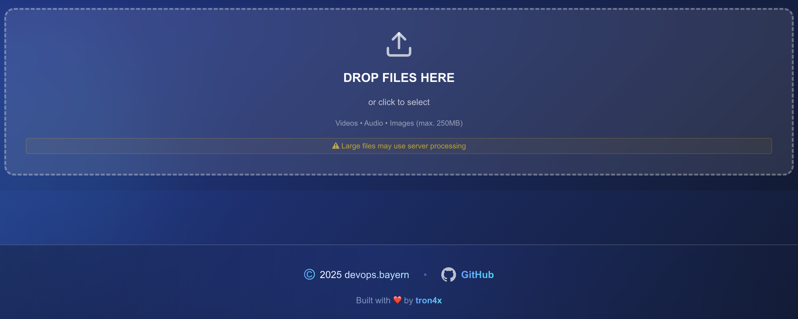

Hi, my name is Konstantinos,

i'm a DevOps Egineer from Munich, Germany

* 🧠  I'm currently working with Next.js, deploying apps on Kubernetes with everything that goes with it....
* 🤝  I'm open to collaborating on Kubernetes and Next.js projects.

### Skills

## My current projects in next.js

MCP-powered cluster management with AI analysis    ( work in progress, pre-release ) 

Intelligent Kubernetes Dashboard with Model Context Protocol (MCP) Frontend / Backend and OpenAI-powered Cluster Analysis  

 
 

-----------------------------------

RAG ChatBot ( Comming soon ) 
 
RAG system that transforms your documents into an intelligent knowledge base with AI-powered search and answers. 
Tech Stack: OpenAI GPT-5, OpenSearch Vector Search, Retrieval-Augmented Generation (RAG), LangChain, Next.js

-----------------------------------

Classic snake game: https://snake.devops.bayern/

-----------------------------------

Media Converter

Live: https://media-converter.devops.bayern/

-----------------------------------

Video App

Git Repo: Comming soon....

-----------------------------------

Media Gallery

Git Repo: [NextJS-Gallery](https://github.com/tron4x/nextjs-gallery)

Live Demo: [Next.js-Gallery](https://gallery.devops.bayern/)

