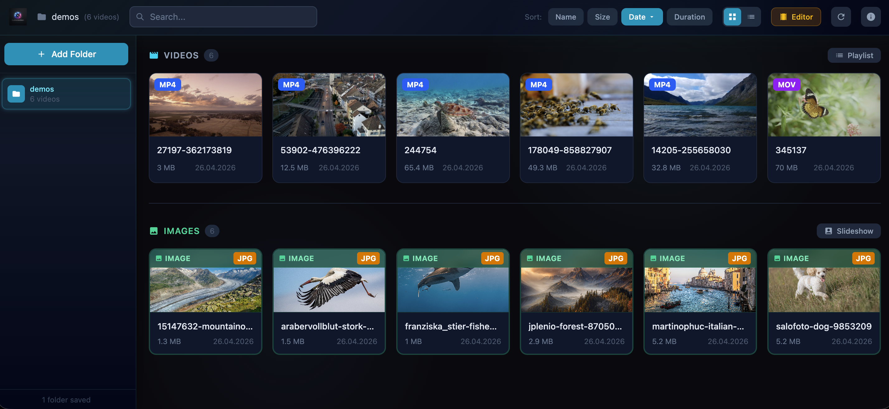
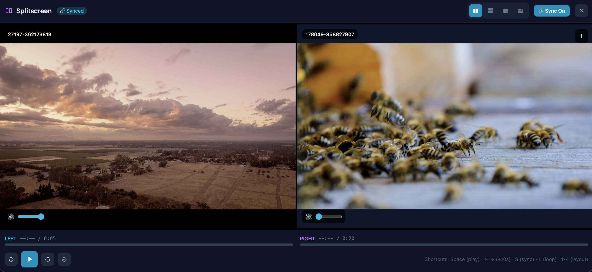
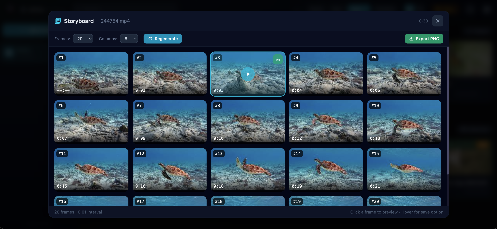

  
# 👋 Hi, I'm Konstantinos

### DevOps Engineer from Munich, Germany 🇩🇪

---

### 🚀 About Me

- 🔧 Currently working with **Next.js** & deploying apps on **Kubernetes**
- 🤝 Open to collaborate on **Kubernetes** and **Next.js** projects
- 🌱 Passionate about **AI/ML**, **DevOps**, and **Cloud Native** technologies

---

## 📂 Featured Projects

### Lumoravision
> Modern Media Player 
>Your local media library — reimagined. No cloud. No upload. No bullshit. 
Drop a folder. Watch. Edit. Export GIFs. All in the browser.

**📦 Repo:** [github.com/tron4x/tronlinkhub](https://github.com/tron4x/lumoravision) — Lumoravision

📸 Screenshots

  
   
  <em>Editor</em>

  
   
  <em>Splitscreen</em>

  
   
  <em>Player</em>

  
   
  <em>Storyboard</em>

### 🌐 TronLinkHub
> A modern, containerized web application for managing and organizing your links and services.

**📦 Repo:** [github.com/tron4x/tronlinkhub](https://github.com/tron4x/tronlinkhub) — TronLinkhub

---
### 🎬 TronVid
> A modern, cross-platform video player

**Tech:** Next.js • Electron • Node.js

**📦 Repo:** [github.com/tron4x/tronvid](https://github.com/tron4x/tronvid) — TronVid

📸 Screenshots

  
   
  <em>Main Window</em>

  
   
  <em>Mini Player</em>

  
   
  <em>Audio Extraction</em>

  
   
  <em>Video Statistics - Chapter Loop</em>

  
   
  <em>Video Editor</em>

  
   
  <em>Video Editor - Export</em>

  
   
  <em>Developer 😊</em>

---

### 🧠 Noema AI
> Self-hosted alternative to Google NotebookLM

AI-powered research assistant with RAG (Retrieval-Augmented Generation) for document interaction.

**Tech:** Next.js • OpenAI • Qdrant • Redis

📸 Screenshots

---

