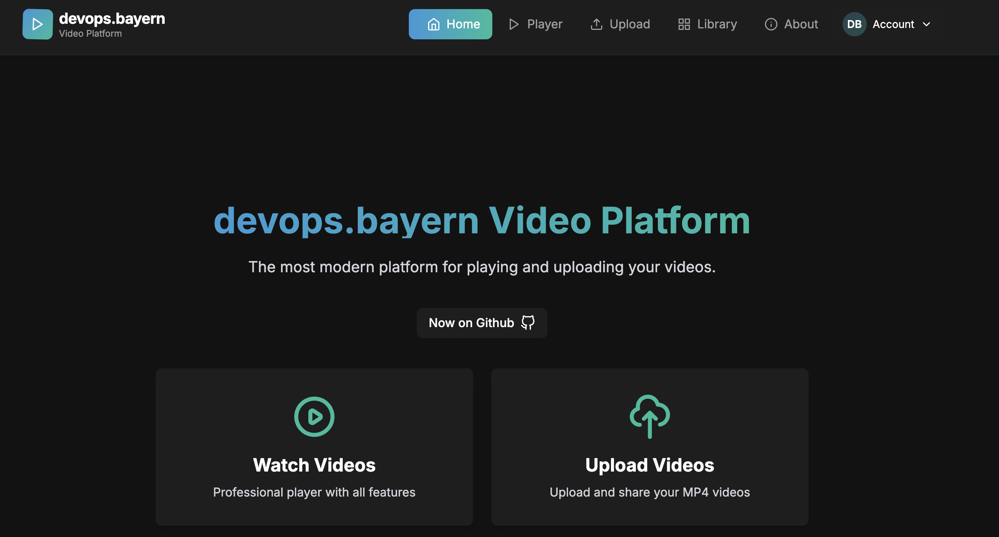

Hi, my name is Konstantinos,

i'm a DevOps Egineer from Munich, Germany

* 🧠  I'm currently working with Next.js, deploying apps on Kubernetes with everything that goes with it....
* 🤝  I'm open to collaborating on Kubernetes and Next.js projects.

### Skills

## My current projects in next.js

Video Platform

Git Repo: [NextJS-Videp-App](https://github.com/tron4x/video-app.git)

Live Demo: [Next.js-Video-App](https://video.devops.bayern/)

-----------------------------------

Media Gallery

Git Repo: [NextJS-Gallery](https://github.com/tron4x/nextjs-gallery)

Live Demo: [Next.js-Gallery](https://gallery.devops.bayern/)

